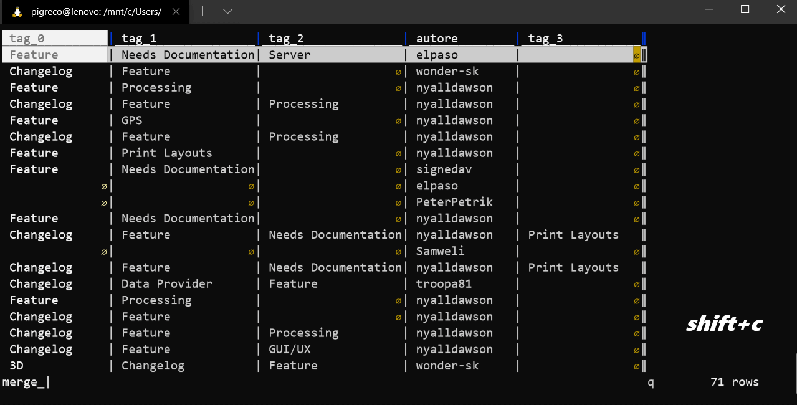
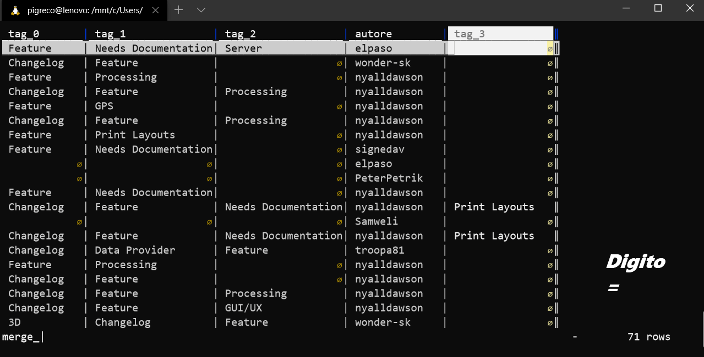

---

## Introduzione

Alcune volte è utile concatenare più campi in modo da crearne uno. Questa operazione è molto semplice e rapida da realizzarsi con **Visidata** in due modi diversi; il primo utilizzando il _foglio delle colonne_, il secondo usando le _espressioni Python_. Di seguito vedemo entrambi i modi.

## Foglio delle colonne

Per visualizzare con **Visidata** un file csv basta avviare la **bash** di linux e:

`vd nomefile.csv`

subito dopo digitare:

`shift+c`

che visualizzarea una tabella dove le righe rappresentano le colonne del file csv;

selezionare, usando il tasto `s` le righe da concatenare e digitare `&`



## Espressioni Python

Visualizzo il file con:

`vd nomefile.csv`



l'espressione python usata è:

```
tag_0 + ';' + tag_1 + ';' + tag_2 + ';' + tag_3
```

dove è possibile scegliere il separatore, in questo caso `;`

## Riferimenti utili

1. [Visidata](http://visidata.org/man/)
2. [Guida Visidata ITA](https://github.com/ondata/guidaVisiData/blob/master/testo/README.md)