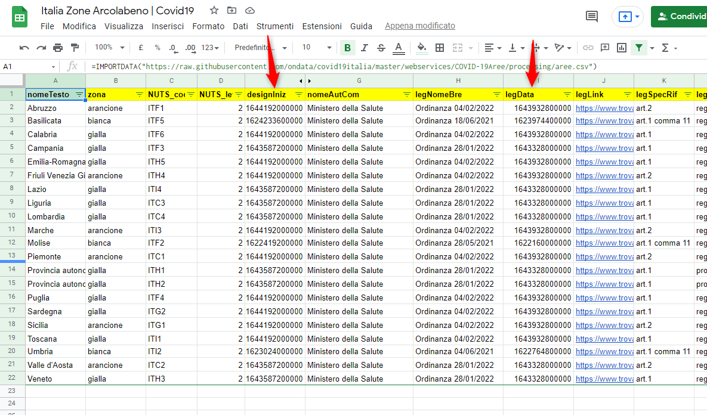
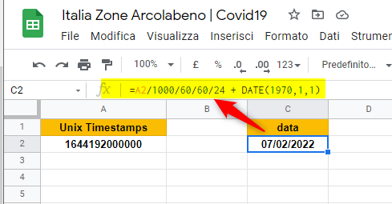
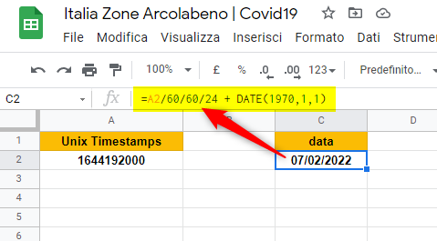

---

Importando il file delle Aree/Regioni soggette a misure restrittive per l'emergenza epidemiologica rilasciate dal [Dipartimento della Protezione Civile](https://github.com/pcm-dpc/COVID-19/tree/master/aree) e rielaborati dall' [Associazione onData | Repo GitHub](https://github.com/ondata/covid19italia/tree/master/webservices/COVID-19Aree) ho notato che le colonne **designIniz** e **legData** hanno una *strana* formattazione `1644192000000` è un errore...? è una data...? 
Utilizzando il **Formato --> data e rora personalizzate** di google sheet provo a cambiare la formattazione, ma non cambia nulla! 
Non è un errore, sicuramente sarà una data, ma in che formato?
Cercando su google capisco che è una data **Unix Timestamps** *machine readable*, ma come renderla leggibile per un uomo usando google sheet?

`=IMPORTDATA("https://raw.githubusercontent.com/ondata/covid19italia/master/webservices/COVID-19Aree/processing/aree.csv")`

In questo caso specifico `1644192000000` Unix Timestamps è espresso in millisecondi e si deve prima dividere per 1000

Formula  `=A2/1000/60/60/24 + DATE(1970,1,1)`

---

`1644192000`	Unix Timestamps

Formula `=A2/60/60/24 + DATE(1970,1,1)`

### Riferimenti utili
- [unixtimestamp.com](https://www.unixtimestamp.com/)
- [epochconverter](https://www.epochconverter.com/)