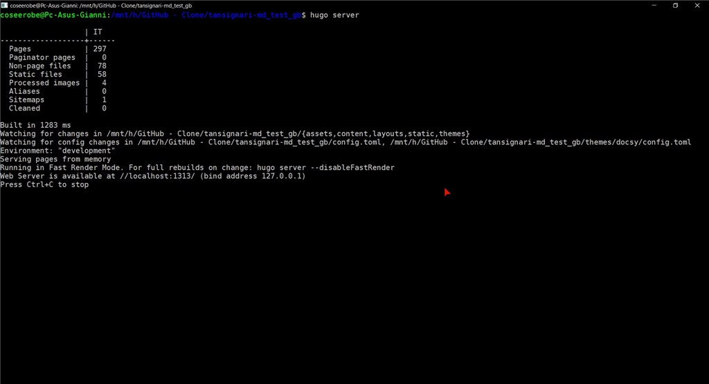

* issue correlata: [#4](https://github.com/opendatasicilia/tansignari-md/issues/4)
* autore: _[Gianni Vitrano](https://twitter.com/gbvitrano?lang=it)_;  fornitore ricetta: _[Totò Fiandaca](https://twitter.com/totofiandaca?lang=it)_;
* ingredienti: [Install Hugo](https://gohugo.io/getting-started/installing/)

## HUGO Server che cos’è?
È un programma, è disponibile praticamente per qualsiasi [piattaforma](https://github.com/gohugoio/hugo/releases/tag/v0.65.2),  in questa ricetta verrà spiegato passo dopo passo come installarlo su nel [bash di Windows](https://www.howtogeek.com/249966/how-to-install-and-use-the-linux-bash-shell-on-windows-10/), ma se desiderate installarlo direttamente su [Windows](https://www.youtube.com/watch?v=G7umPCU-8xc) o e [Mac OS](https://www.youtube.com/watch?v=WvhCGlLcrF8) ci sono molte guide in inglese online,

## Come installare Hugo Server,  Linux Bash Shell di Windows 10

- dal repository [hugo](https://github.com/gohugoio/hugo), [releases ](https://github.com/gohugoio/hugo/releases), copiare il link : https://github.com/gohugoio/hugo/releases/download/v0.65.2/hugo_extended_0.65.2_Linux-64bit.tar.gz
- lanciare la shell di Linux da una nuova cartella:
`wget https://github.com/gohugoio/hugo/releases/download/v0.65.2/hugo_extended_0.65.2_Linux-64bit.tar.gz`
- dopo il download, lanciare: ` tar -xzf hugo_extended_0.65.2_Linux-64bit.tar.gz`
- dopo aver unzippato, lanciare : `which jq` per capire in che cartella spostare il programma `hugo`
- spostare il file, lanciare : ` sudo cp ./hugo /usr/bin/`
- inserire la password di amiministratore: `********`
- dare i permessi, lanciare: `sudo chmod +x ./hugo`
- cambiare cartella, ad esempio `cd ~`
- verificare installazione di `hugo`, lanciare : `hugo version`
- lanciare il server: aprire la bash Shell nella cartella che ospita il repository locale di github e scrivre `hugo server` dopo qualche secondo il sito web viene cotruito.

Adesso non resta che digitare `bash` nella bara degli indirizzi di esplora risorse e si aprirà la Linux Bash Shell di Windows 10 nella cartella del repo

- lanciare il server: `hugo server`

- visualizzare il sito sul web browser: `http://localhost:1313/` 

**Aggiornare Hugo** è facile come scaricare e sostituire l'eseguibile che hai inserito nel **PERCORSO** 