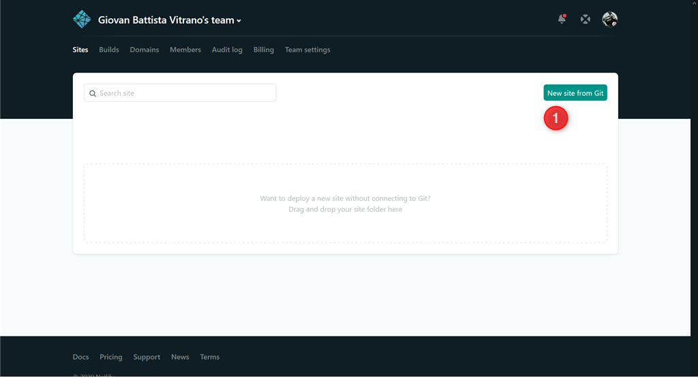
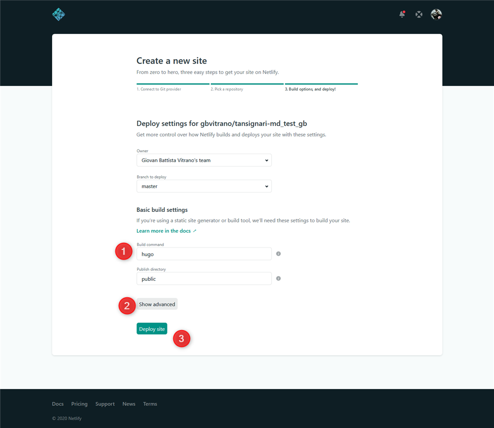
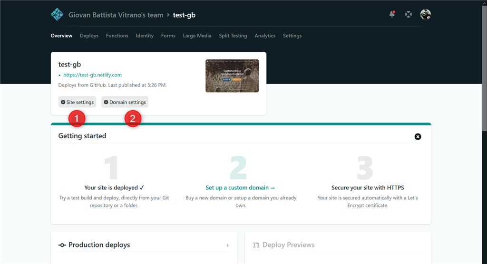

---

* autore: _[Gianni Vitrano](https://twitter.com/gbvitrano?lang=it)_; fornitore ricetta: *[Andrea Borruso](https://twitter.com/aborruso?lang=it)*;
* ingredienti: [Host on Netlify](https://gohugo.io/hosting-and-deployment/hosting-on-netlify/)

## Pubblicare il sito online
Dopo aver visto come installare [Hugo](../installare_hugo_server_locale/) nel pc locale, in questa ricetta affronteremo il tema della pubblicazione online del sito. Per farlo useremo l'app [Netlify](https://app.netlify.com) 

## Cos'è Netlify?
[Netlify](https://app.netlify.com)  è un sistema di gestione dei contenuti open source per il flusso di lavoro Git. Fornisce agli editor un’interfaccia utente intuitiva e facile anche a chi non ha dimestichezza con i codici.

## Crea un account Netlify

Aprire il sito [app.netlify.com](app.netlify.com) e selezionare il metodo di iscrizione preferito. Questo sarà probabilmente il provider che ospita il Git, c'è anche la possibilità di registrarti con un indirizzo email.

Nel mio caso mi sono registrato usando l'accontu di GitHub, anche gli altri provider git seguono un processo simile.

Selezionando GitHub verrà visualizzato un finestra di autorizzazione per l'autenticazione. Seleziona **Autorizza applicazione**. Dopo qualche minuto il nuovo account su [app.netlify.com](app.netlify.com) è attivo.

## Creare un nuovo sito con pubblicazione continua

Aggiungere un nuovo sito alla dashboard è semplicissimo, basta cliccare sul punto (1) **New site from git.** 

[Netlify](https://app.netlify.com) inizierà quindi a seguire i passaggi necessari per la pubblicazione continua. Innanzitutto, si deve selezionare nuovamente il tuo provider Git, per dare a [Netlify](https://app.netlify.com) autorizzazioni aggiuntive per i repository.

A questo punto basta selezionare il repository che si desidera utilizzare per la pubblicazione continua. Se disponi di un numero elevato di repository, si possono filtrare in tempo reale utilizzando la ricerca repository.

Una volta selezionato, si apre la una schermata per la configurazione di base. Qui si può selezionare il ramo che vuole pubblicare, il comando **build** e la directory publishing (ovvero deploy). 
La directory di pubblicazione dove rispecchiare quella si è impostata nella configurazione del sito, il cui valore predefinito è pubblico.

## Configurare la versione di Hugo in Netlify

Già con la configurazione di base proposta da [Netlify](https://app.netlify.com) basta cliccare sul pulsante (3) **Deploy Site** ed il sito in pochi minuti verrà costruito.  
Nel nostro caso abbiamo usato il tema [Goldydocs](https://example.docsy.dev/) e abbiamo modificato la configurazione di base seguendo i consigli di **[Docsy | Previews and Deployment](https://www.docsy.dev/docs/deployment/#deployment-with-netlify)**.

* (1) Per il comando **Build** specificare `cd themes/docsy && git submodule update -f --init && cd ../.. && hugo` in modo che [Netlify](https://app.netlify.com) possa usare i sottomoduli del tema.
* (2) Clicca su **Show advanced** nella sezione impostazioni di build avanzate fai clic su Nuova variabile e specifica **Key** `HUGO_VERSION` **new variable** 0.64.1  
Ps. il valore **new variable** 0.64.1 indica la versione di [Hugo](../installare_hugo_server_locale/) che abbiamo installato nel pc locale.
* (3) Cliccare su **Deploy site** per pubblicare il sito.

## Configurare e ottimizzare la pubblicazione online

Dopo aver pubblicato il sito, cliccanso sui pulsati (1) **Site setting**  e  (2) **Domain setting** si possono modificare e migliorare una serire di parametri, come il nome del sito, aggiungere un dominio, attivare o disattivare la pubblicazione automatica ad ogni **commits** 

Buon lavoro :-) 

