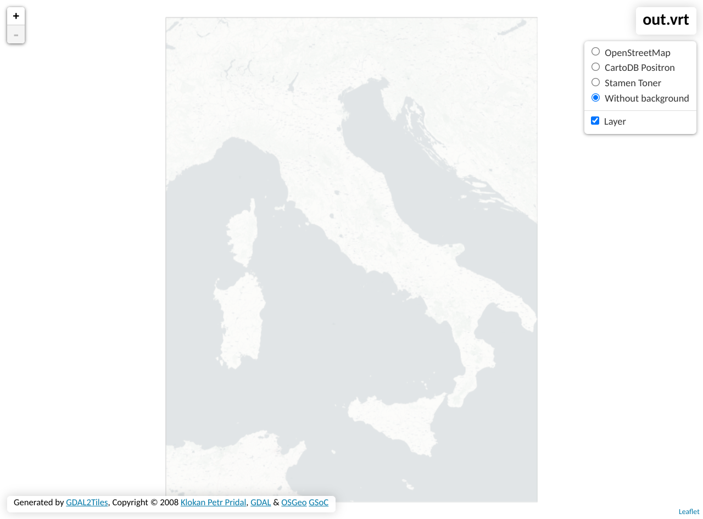

---

## Il Problema

Può presentarsi l'esigenza di visualizzare delle mappe in modalità offline, che siano incluse in una determinata [bounding box](https://wiki.openstreetmap.org/wiki/Bounding_Box).  
Specificatamente, questa ricetta illustra gli ingredienti necessari per scaricare tutte le [tiles](https://wiki.openstreetmap.org/wiki/Tiles) incluse all'interno del [territorio italiano](https://github.com/openpolis/geojson-italy/blob/master/geojson/limits_IT_regions.geojson).

Utilizzando [gdal2tiles](https://gdal.org/programs/gdal2tiles.html), è possibile ottenere le tiles a partire da un sorgente in formato [TMS](https://gdal.org/drivers/raster/wms.html#tms), appositamente descritto in formato XML.

Tramite [gdal_translate](https://gdal.org/programs/gdal_translate.html) possiamo derivare le immagini delle tiles a partire da una bounding box.

---

## La Soluzione

Data una base map e una determinata coppia di coordinate in gradi decimali `EPSG:4326` che stabilisce la bounding box desiderata,  
nel nostro esempio:  
- BBox: `[6.62662136853768, 47.091783746462156, 18.52038159909892, 35.493691935511414]`  
- Base: `https://basemaps.cartocdn.com/light_all/${z}/${x}/${y}.png`  

### Steps:

1. Descriviamo la fonte iniziale che andremo a "tagliare" successivamente, che quindi includerà le boundaries dell'intero pianeta, salvato all'interno di un file in formato XML che chiameremo `carto.wms`  
    
    `carto.wms`
    ```xml
    <GDAL_WMS>
    <Service name="TMS">
    <ServerUrl>https://basemaps.cartocdn.com/light_all/${z}/${x}/${y}.png</ServerUrl>
    </Service>
    <DataWindow>
    <UpperLeftX>-20037508.34</UpperLeftX>
    <UpperLeftY>20037508.34</UpperLeftY>
    <LowerRightX>20037508.34</LowerRightX>
    <LowerRightY>-20037508.34</LowerRightY>
    <TileLevel>18</TileLevel>
    <TileCountX>1</TileCountX>
    <TileCountY>1</TileCountY>
    <YOrigin>top</YOrigin>
    </DataWindow>
    <Projection>EPSG:3857</Projection>
    <BlockSizeX>256</BlockSizeX>
    <BlockSizeY>256</BlockSizeY>
    <BandsCount>3</BandsCount>
    <UserAgent>Mozilla/5.0</UserAgent>
    <ZeroBlockHttpCodes>204,404,403</ZeroBlockHttpCodes>
    <Cache/>
    </GDAL_WMS>
    ```
2. Convertiamo le coordinate della bounding box desiderata da `EPSG:4326` a `EPSG:3857` tramite [questo link](https://products.aspose.app/gis/en/transformation/lat-long-to-mercator). Le nuove coordinate, questa volta definite in formato Google Mercator, diventano:   
    
    `[737672.12, 5957068.41, 2061679.45, 4231175.95]`

3. Descriviamo un output virtuale che tenga conto delle bounding box derivate. I parametri delle coordinate sono inseriti in questo ordine: ulx uly lrx lry, ovvero x e y upper left, e x e y lower right.  

    `gdal_translate -of VRT -projwin 737672.12 5957068.41 2061679.45 4231175.95 carto.wms out.vrt`

4. Lanciamo `gdal2tiles` includendo la fonte, e la descrizione che abbiamo appena generato, ad esempio per i livelli di zoom 6 e 7:  

    `gdal2tiles.py -z 6-7 -e --profile=mercator out.vrt`  

    <em>Il parametro `-e` è molto utile perchè abilita il resume mode, permettendo di scaricare solo le tiles che non sono già state scaricate.</em>

---

## Risultato

Una volta scaricate tutte le tiles, `gdal2tiles` genera anche delle pagine precompilate che permettono la visualizzazione delle tiles appena scaricate.  

`leaflet.html`  


---

## Riferimenti utili

- [**EPSG:4326**](https://epsg.io/4326)
- [**EPSG:3857**](https://epsg.io/3857)
- [**gdal_translate**](https://gdal.org/programs/gdal_translate.html)
- [**gdal2tiles**](https://pypi.org/project/gdal2tiles/)