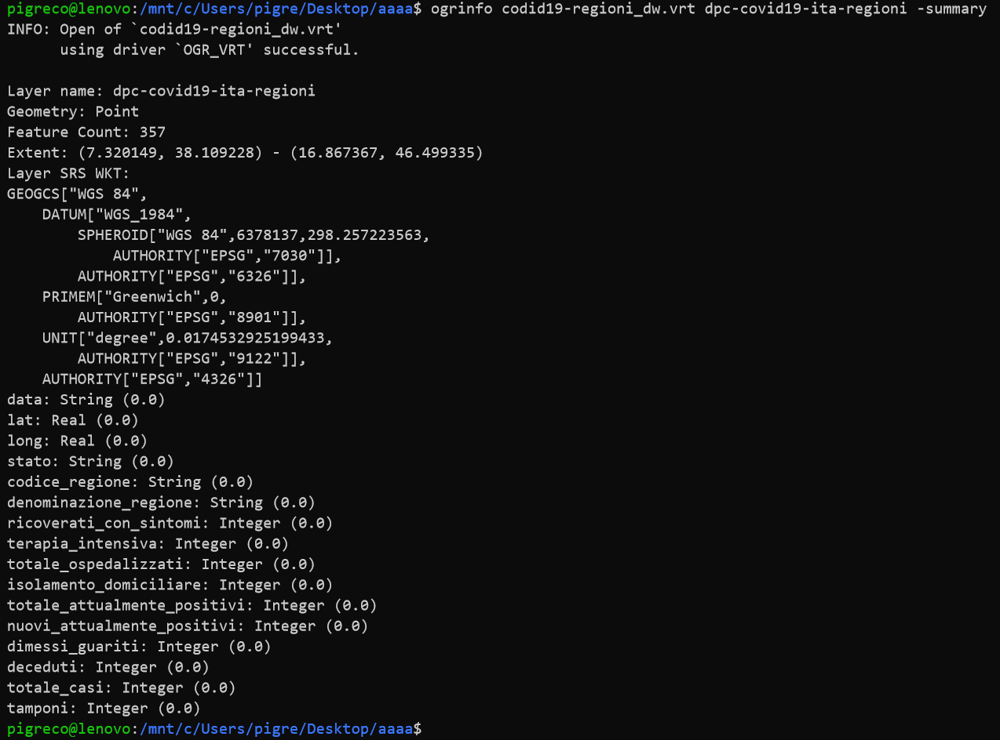
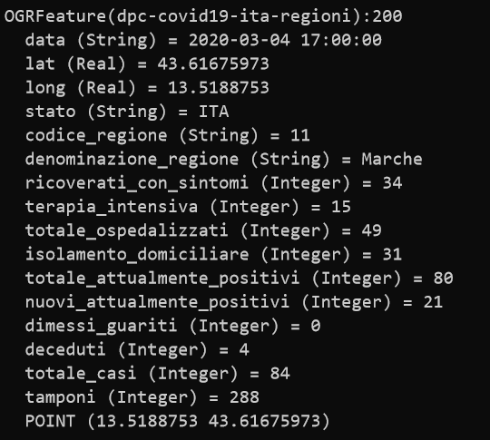
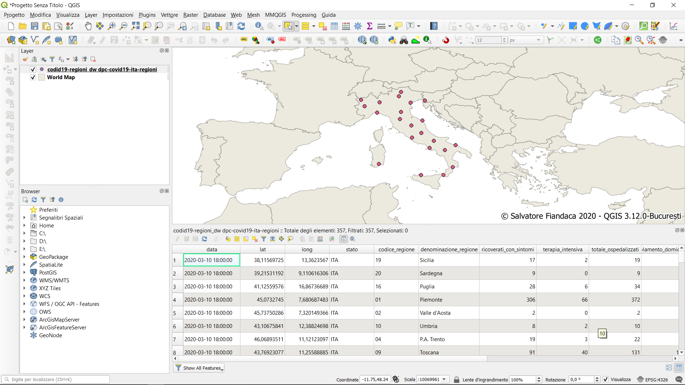

---

## Introduzione

Alcune volte è necessario utilizzare dei file **CSV** remoti e leggerli attraverso vari strumenti, in questo caso con **QGIS**. I file **CSV** sono file testuali separati da un delimitatore. In generale i campi del **CSV** non hanno definito la tipologia dei campi e quindi sono letti come se fossero tutto testo. Vediamo come ovviare a questo problema.

## File CSV RAW da GitHub

Un modo per impostare il tipo di campo è usare, come source, un [Virtual File Format](https://gdal.org/drivers/vector/vrt.html#virtual-file-format) di **GDAL/OGR** cosi strutturato:

```xml
<OGRVRTDataSource>
<OGRVRTLayer name="dpc-covid19-ita-regioni">
    <SrcDataSource relativeToVRT="0">/vsicurl/https://raw.githubusercontent.com/pcm-dpc/COVID-19/master/dati-regioni/dpc-covid19-ita-regioni.csv</SrcDataSource>
    <GeometryType>wkbPoint</GeometryType>
    <LayerSRS>WGS84</LayerSRS>
    <Field name="data" type="String" />
    <Field name="lat" type="Real" />
    <Field name="long" type="Real" />
    <Field name="stato" type="String" />
    <Field name="codice_regione" type="String" />
    <Field name="denominazione_regione" type="String" />
	<Field name="ricoverati_con_sintomi" type="Integer" />
    <Field name="terapia_intensiva" type="Integer" />
    <Field name="totale_ospedalizzati" type="Integer" />
    <Field name="isolamento_domiciliare" type="Integer" />
    <Field name="totale_attualmente_positivi" type="Integer" />
    <Field name="nuovi_attualmente_positivi" type="Integer" />
    <Field name="dimessi_guariti" type="Integer" />
    <Field name="deceduti" type="Integer" />
    <Field name="totale_casi" type="Integer" />
    <Field name="tamponi" type="Integer" />
    <GeometryField encoding="PointFromColumns" x="long" y="lat"/>
</OGRVRTLayer>
</OGRVRTDataSource>
```
Qui [CSV](https://raw.githubusercontent.com/pcm-dpc/COVID-19/master/dati-regioni/dpc-covid19-ita-regioni.csv) remoto.

Per leggere il quadro sinottico del file con OGR:

```
ogrinfo codid19-regioni_dw.vrt dpc-covid19-ita-regioni -summary
```



Per leggere i dati con OGR:

```
ogrinfo codid19-regioni_dw.vrt dpc-covid19-ita-regioni
```

qui un record del file:



Per leggere il file con QGIS, DragAndDrop del file `codid19-regioni_dw.vrt` nella gui di QGIS:


---

## Riferimenti

- [GDAL](https://gdal.org/)
- [Virtual File Format](https://gdal.org/drivers/vector/vrt.html#virtual-file-format)
