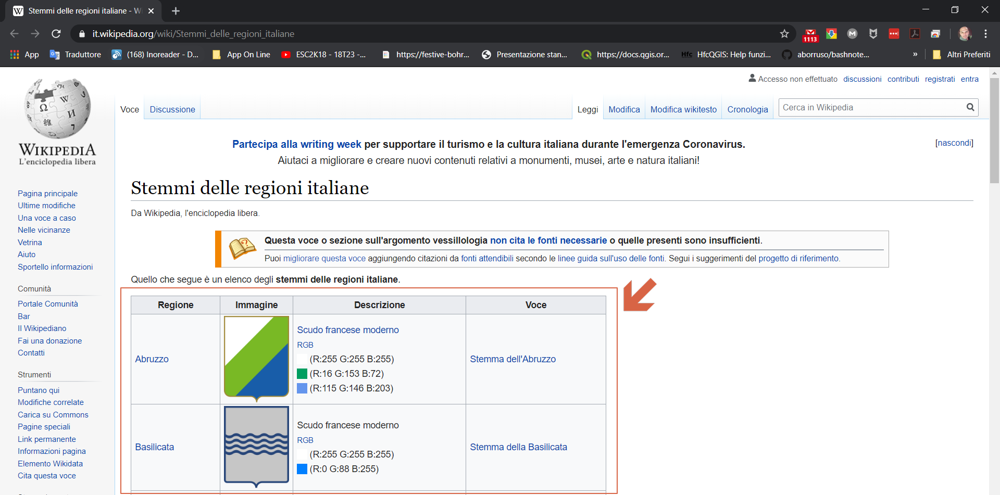
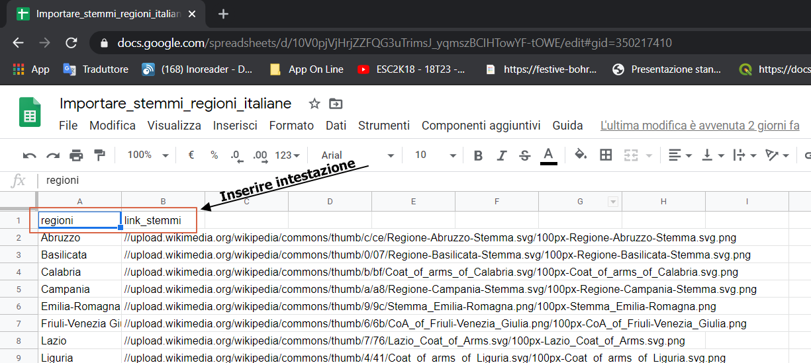
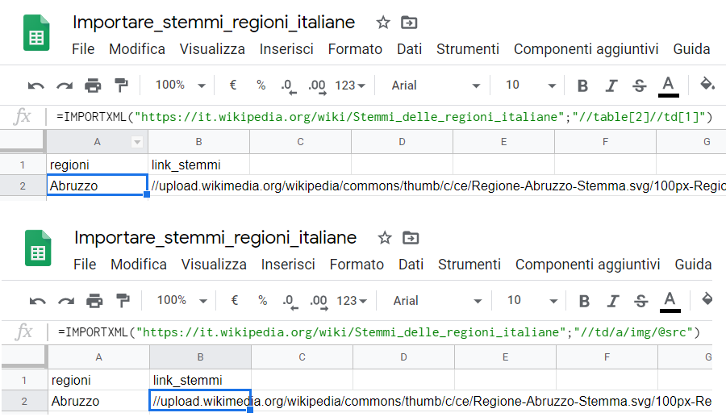
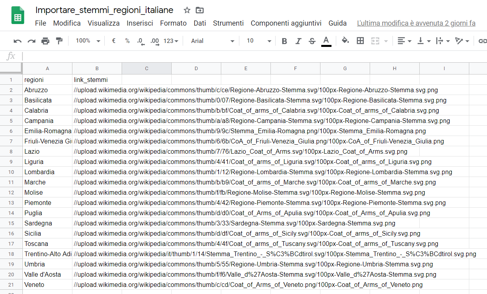
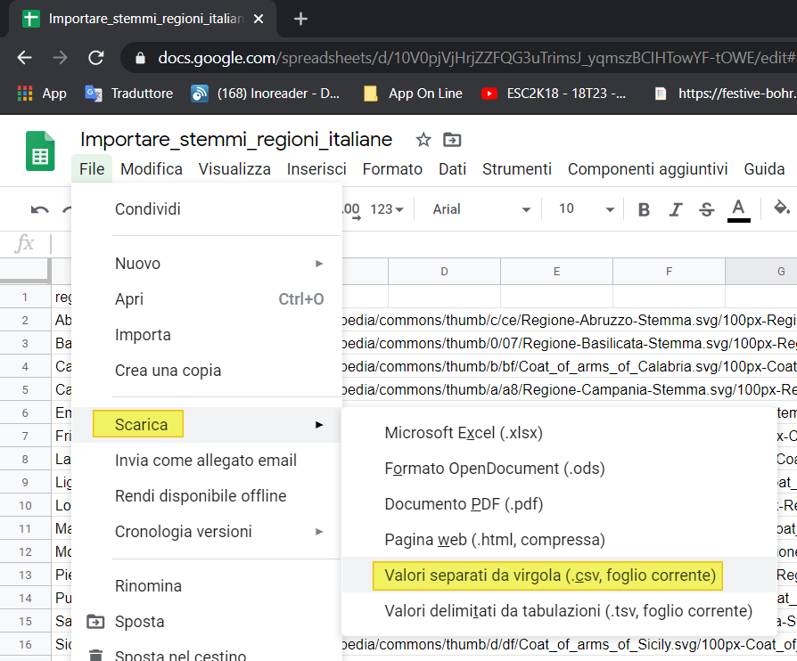

---

**Caso d'uso:** Scaricare i dati di questa tabella, in particolare i primi due campi (Regione e link immagine).



## Usando gsheet

- Inserire le intestazioni nelle prime due colonne: `regioni` e `link_stemmi`



- nella cella `A2` incollare il comando:

```
=IMPORTXML("https://it.wikipedia.org/wiki/Stemmi_delle_regioni_italiane";"//table[2]//td[1]")
```

- nella cella `B2` incollare il comando:

```
=IMPORTXML("https://it.wikipedia.org/wiki/Stemmi_delle_regioni_italiane";"//td/a/img/@src")
```



- output



## Esportare in CSV

Dal menu `File` → `Scarica` → `Valori separati da virgola`



**NB:** per impostazioni `italiane` di gsheet, nel comando di sopra, occorre usare il `;` altrimenti per impostazioni internazionli `,`.

---

## Riferimenti utili

1. [IMPORTXML](https://support.google.com/docs/answer/3093342?hl=it)
2. [Wikipedia](https://it.wikipedia.org/wiki/Stemmi_delle_regioni_italiane)