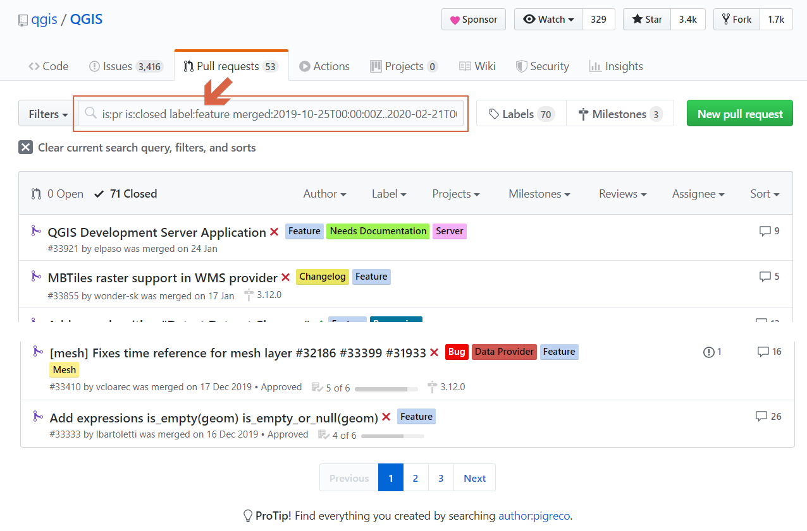
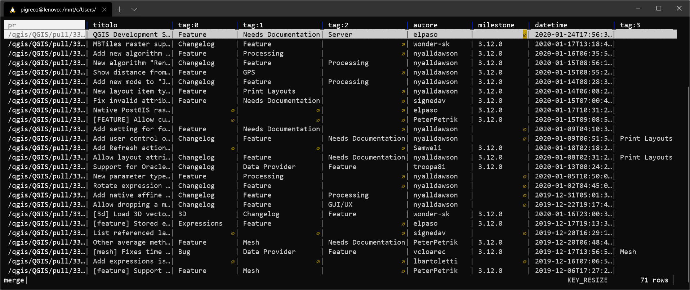
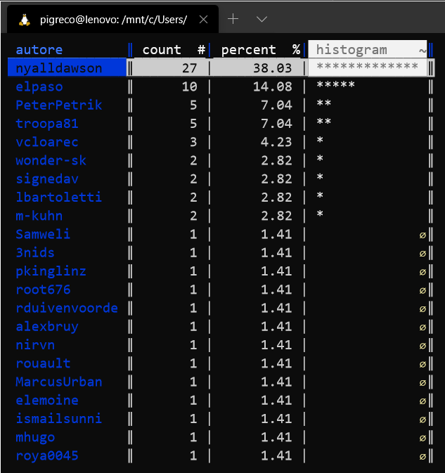

---

## Introduzione

**Caso d'uso:** Ogni nuova `Feature` viene proposta, nel repository GitHub di [QGIS](https://github.com/qgis/QGIS), tramite una `PR` (Pull Request) dove si discute, si fanno modifiche e poi, se va bene, viene fatto il `merge` al ramo principale.

Ogni sviluppatore aggiunge il **tag** `Feature` assieme ad altri **tag** più specifici che ne identificano la categoria (`processing`, `expressions`,`label`, ecc..).

Ogni 4 mesi esce una nuova versione QGIS e contestualmente vengono redatte i `changelog`, una pagina web in cui è possibile vedere tutte le nuove `feature` introdotte nell'intervallo temporalw specificato in `merged:`.

Usando questo `filtro`:

```
is:pr is:closed label:feature merged:2019-10-25T00:00:00Z..2020-02-21T00:00:00Z
```
in questa pagina: https://github.com/qgis/QGIS/pulls

ottengo tutte le **PR** (con `tag:feature`) per la nuova versione di **QGIS**.



## In Bash

Lo script che scarica (`curl`), gratta (`scrape`), converte (`xq`) HTML in JSON, converte (`mlr`) JSON in CSV, mergia (`mlr`) e visualizza (`vd`):

```bash
#!/bin/bash
# filtro github: is:pr is:closed label:feature merged:2019-10-25T00:00:00Z..2020-02-21T00:00:00Z 
set -x
# rimuovo file csv
rm *.csv
#ciclo per le tre pagine web
for p in {1..3}
do
    curl "https://github.com/qgis/QGIS/pulls?page=""$p""&q=is%3Apr+is%3Aclosed+label%3Afeature+merged%3A2019-10-25T00%3A00%3A00Z..2020-02-21T00%3A00%3A00Z&utf8=%E2%9C%93" | scrape -be ".pr-md-2"  |xq '.html.body.div[]|{pr:.a["@href"]?,titolo:.a["#text"]?,tag:[.span[1].a[]["#text"]?],autore:.div.span[0].a["#text"]?,milestone:.div.span[2]?.a["@aria-label"]?,datetime:.div.span[0]["relative-time"]["@datetime"]}' | mlr --j2c unsparsify >pag"$p".csv
done
# mergia i tre file csv
mlr --csv unsparsify *.csv >merge.csv
# elimino i file csv inutili
rm pag*.csv
# apro il file con visidata
vd merge.csv
```



### Visualizzo statistiche



## Chi ha cucinato questa ricetta o ne ha tratto ispirazione

- [Blog Post](https://pigrecoinfinito.com/2020/02/25/qgis-e-i-changelog-3-12-scraping-da-repo-github/) su Pigrecoinfinito by Totò Fiandaca

---

## Riferimenti utili

1. [QGIS](https://qgis.org/it/site/)
2. [Curl](https://curl.haxx.se/)
3. [Scrape](https://github.com/aborruso/scrape-cli)
4. [xq](https://github.com/kislyuk/yq)
5. [GitHub](https://github.com/)
6. [Miller](https://github.com/johnkerl/miller)
7. [Visidata](http://visidata.org/man/)
