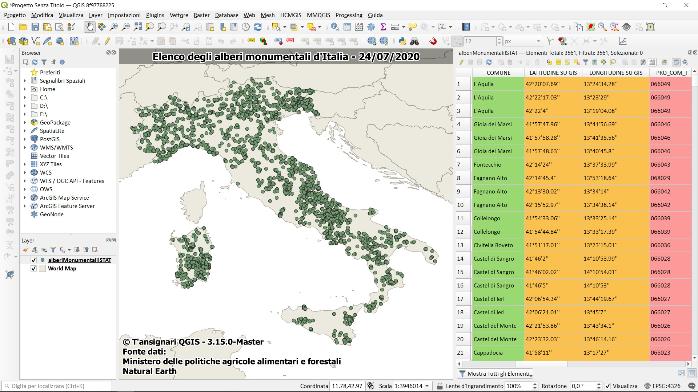

---

L' elenco degli alberi monumentali d'Italia ai sensi della Legge n. 10/2013 e del Decreto 23 ottobre 2014 è stato _aggiornato al 24-07-2020_, in questa ricetta vedremo come scaricare i file `*.xls` presenti nel [sito](https://www.politicheagricole.it/flex/cm/pages/ServeBLOB.php/L/IT/IDPagina/11260) del **Ministero delle politiche agricole alimentari e forestali** e creeremo un unico file CSV.

Le difficoltà sono legati alla presenza di 21 file (da scaricare) in formato `xls`, uno per ogni regione e le Province Autonoma; le coordinate (DMS) hanno uno spazio che li rende inutilizzabili e la virgola al posto del punto decimale; per risolvere tutti questi problemi abbiamo realizzato il seguente script bash che crea un unico file CSV pronto all'uso.

## Script bash

```bash
#/bin/bash

### requisiti ###
# miller https://github.com/johnkerl/miller
# scrape https://github.com/aborruso/scrape-cli
# pyexcel-cli https://github.com/pyexcel/pyexcel-cli
# pyexcel-xls https://github.com/pyexcel/pyexcel-xls
# yq https://github.com/kislyuk/yq
# parallel https://www.gnu.org/software/parallel/
### requisiti ###

set -x

mkdir -p ./rawdata
mkdir -p ./processing

# cancella file xls
rm ./rawdata/*.xls

# scrica i file xls
curl "https://www.politicheagricole.it/flex/cm/pages/ServeBLOB.php/L/IT/IDPagina/11260" |
  # estrai dati sui file XLS degli alberi
  scrape -be ".blob-element-download .viewLinkIMG" |
  # estrai proprietà href e text (URL e nome file)
  xq -r '.html.body.a[]|[."@href",."#text"]|@tsv' |
  # fai partire il download
  parallel --colsep '\t' wget {1} -O ./rawdata/{2}.xls

for i in ./rawdata/*.xls; do
  #crea una variabile da usare per estrarre nome e estensione
  filename=$(basename "$i")
  #estrai estensione
  extension="${filename##*.}"
  #estrai nome file
  filename="${filename%.*}"
  # converti file XLS in CSV
  pyexcel transcode --sheet-index 0 "$i" ./processing/"$filename".csv
done

# unisci i file, tenendo conto di eventuali campi in più e fai pulizia di eventuali spazi bianchi in più
mlr --csv unsparsify then clean-whitespace ./processing/*.csv >./alberi.csv

# dalle coordinate rimuovi spazi e sostituisci "," con "."
mlr -I --csv put '${LATITUDINE SU GIS}=gsub(${LATITUDINE SU GIS}," ","");${LONGITUDINE SU GIS}=gsub(${LONGITUDINE SU GIS}," ","");${LATITUDINE SU GIS}=gsub(${LATITUDINE SU GIS},",",".");${LONGITUDINE SU GIS}=gsub(${LONGITUDINE SU GIS},",",".")' ./alberi.csv
```
## Nota

Al file finale è stato aggiunto il campo `PRO_COM_T` che contiene il codice testuale ISTAT del Comune dove ricade l'albero monumentale, l'aggiunta è stata realizzatoa usando `Mapshaper`.

### Mapshaper

È un’utility “geografica” straordinaria, purtroppo non troppo nota. Consente di modificare Shapefile, GeoJSON, TopoJSON, CSV e altri formati e supporta diversi task essenziali come la semplificazione di forme (è la caratteristica per cui è più noto), la modifica di attributi, il clipping, il dissolve, il filtraggio e anche il join spaziale (che è ciò che serve qui).
Il comando ha questa struttura di base

```
mapshaper alberiMonumentali.geojson -join ./risorse/comuni.shp fields=PRO_COM_T -o alberiMonumentaliISTAT.csv
```

Per punti:

* si definisce il layer a cui si vogliono associare dati (in questo caso quello degli alberi);
* si definisce l’operatore, qui `join`;
* si definisce il layer che contiene le informazione da associare al layer di destinazione (qui i limiti comunali);
* si definisce quale campo del file sorgente si vuole passare a quello di destinazione (qui il codice `PRO_COM_T`);
* si definisce il file di output.
Mapsharper è molto rapido e “stampa” in output alcune informazioni:

```
[join] Joined data from 1,309 source records to 3,550 target records
[join] 5/3555 target records received no data
[join] 6595/7904 source records could not be joined
[o] Wrote alberiMonumentaliISTAT.csv
```

## Visualizzazione



## Dati

1. file **CSV** (UTF-8, delimitatore=",") (su gdrive): [visualizza/scarica](https://docs.google.com/spreadsheets/d/1Hfmpm6yO8Ma7EfFVQSo4GAReXZAFaSlgKeeROvIEcRw/edit?usp=sharing)
2. file **geojson** (gist) : [visualizza/scarica](https://gist.github.com/pigreco/c9e5680d7db7e6e7c405f73dce2c3c47)
3. file **CSV** zippato : [scarica](https://gist.github.com/pigreco/e0f38a1cf6bd90b6f8258f01fda828cc/archive/d3957ba4855a729370db6117e7e5d634cf1832fe.zip)