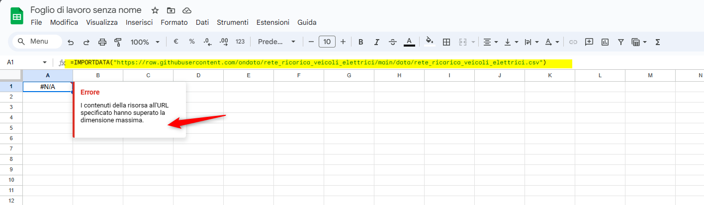
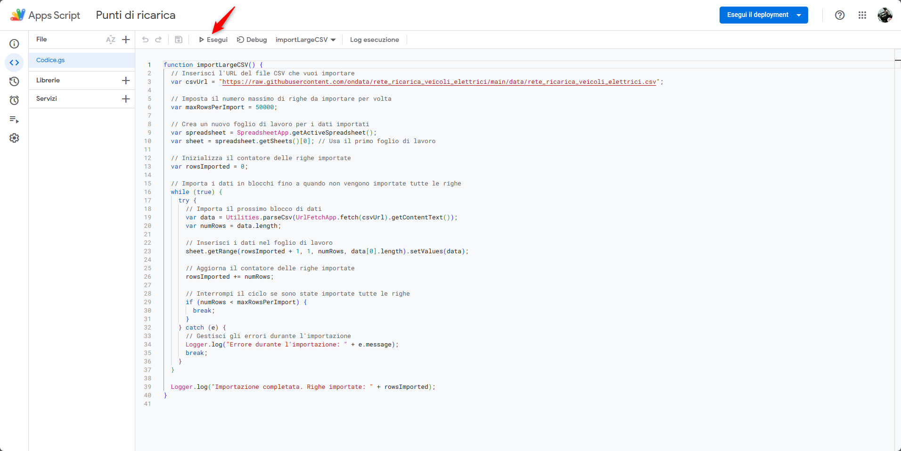
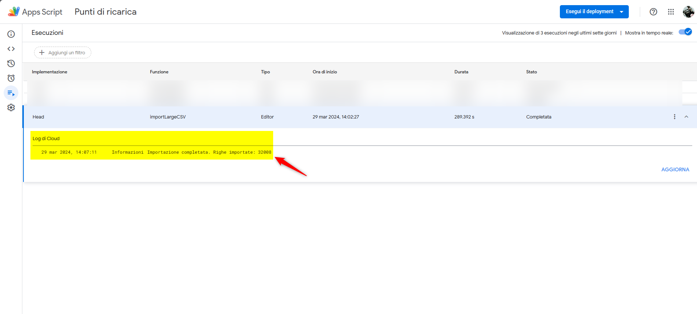
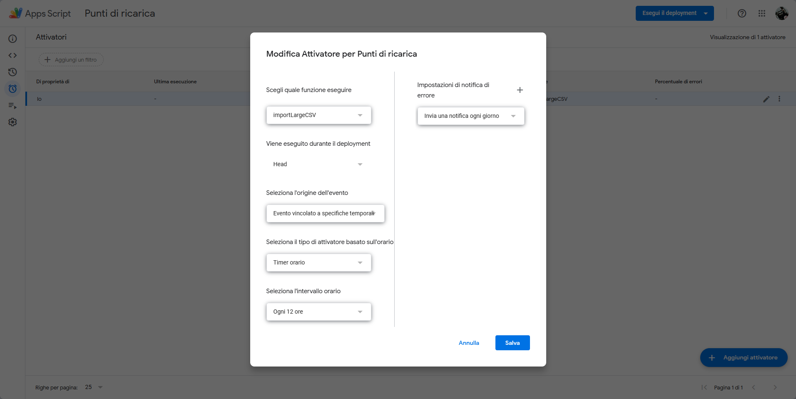
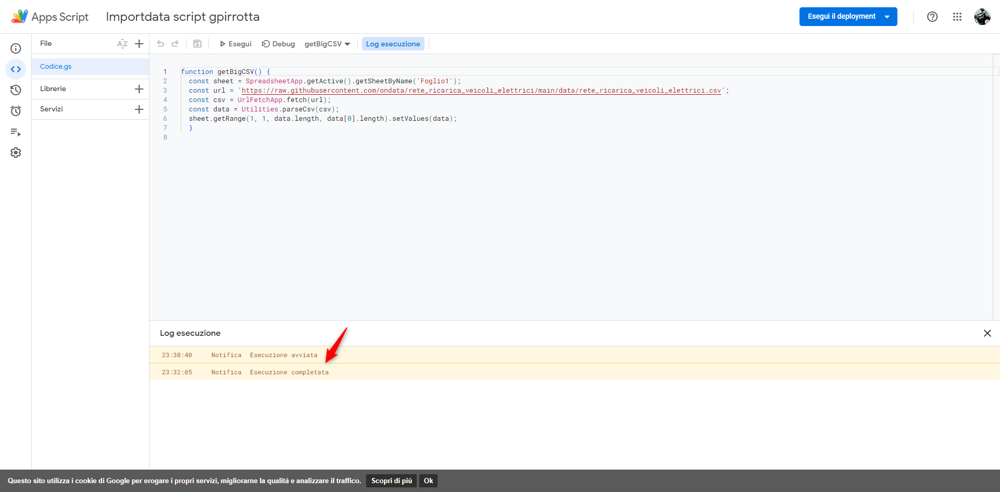
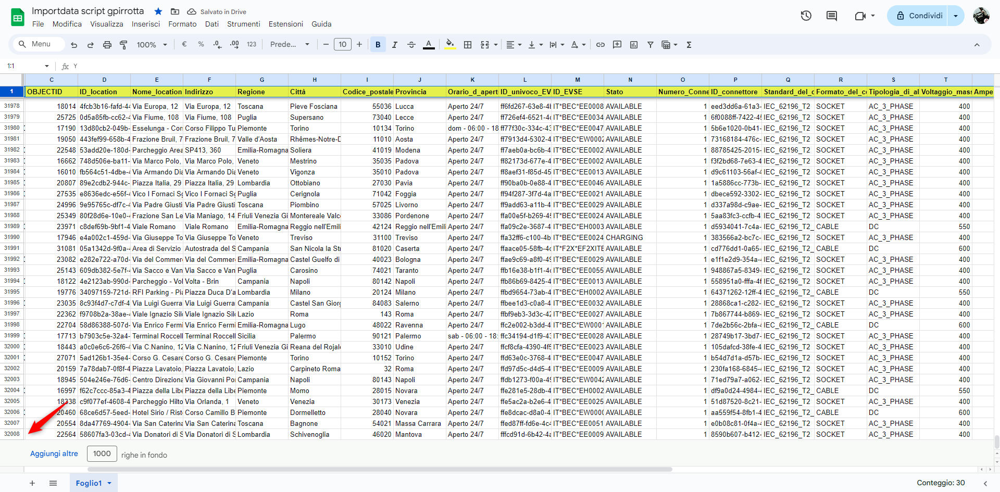

---

La funzione [IMPORTDATA()](https://support.google.com/docs/answer/3093335?hl=en) di Google sheet consente di importare file CSV con um massimo di 20.000 righe, per superare il limite bisognerebbe suddividere in più file il CSV. E se non possibile suddividere il file come supero il limite delle 20.000 righe?

## Errore durate l'importazione di un file CSV
Supponiamo di voler importare i dati di un file .csv da remoto, in questo caso i dati del [PUN](https://www.piattaformaunicanazionale.it/) Piattaforma Unica Nazionale dei punti di ricarica per i veicoli elettrici, resi disponibili dall'associazione [onData](https://github.com/ondata/rete_ricarica_veicoli_elettrici). <br>
Ci posizioniamo nella  cella **A1** del nostro foglio di lavoro scriviamo la seguente funzione:<br><br>
```=IMPORTDATA("https://raw.githubusercontent.com/ondata/rete_ricarica_veicoli_elettrici/main/data/rete_ricarica_veicoli_elettrici.csv")```
dopo qualche secondo ci verrà restituito l'errore. <br><br>
**I contenuti della risorsa all'URL specificato hanno superato la dimensione massima**



Come forzare il caricamento del file CSV?

Seguendo un cosiglio di [@aborruso](https://twitter.com/aborruso) cerco una soluzione usando AI, ad essere precisi uso [#PerplexityAI](https://www.perplexity.ai/), un chatbot AI e motore di ricerca conversazionale che si appoggia a ChatGPT-3.5-turbo combinandolo a un LLM molto sofisticato che, sfruttando l’elaborazione del linguaggio naturale e alcune funzioni per l’apprendimento automatico, è in grado di rispondere a qualsiasi domanda gli venga posta.<br><br>
Qui un [webinar](https://www.youtube.com/watch?v=s63f90pUu0Y) di [@aborruso](https://twitter.com/aborruso) sull'uso di [#PerplexityAI](https://www.perplexity.ai/)

## PerplexityAI
E' bastato scrivere la richiesta sulla barra di ricerca e in pochi istanti [#PerplexityAI](https://www.perplexity.ai/) mi ha dato una soluzione e mi ha spiegato come usarla.


Ecco uno script in Google Apps Script che ti permette di importare un file CSV che supera il limite di dimensione in Google Sheets:

```
javascript
function importLargeCSV() {
  // Inserisci l'URL del file CSV che vuoi importare
  var csvUrl = "https://example.com/large-file.csv";
  
  // Imposta il numero massimo di righe da importare per volta
  var maxRowsPerImport = 50000;
  
  // Crea un nuovo foglio di lavoro per i dati importati
  var spreadsheet = SpreadsheetApp.getActiveSpreadsheet();
  var sheet = spreadsheet.getSheets()[0]; // Usa il primo foglio di lavoro
  
  // Inizializza il contatore delle righe importate
  var rowsImported = 0;
  
  // Importa i dati in blocchi fino a quando non vengono importate tutte le righe
  while (true) {
    try {
      // Importa il prossimo blocco di dati
      var data = Utilities.parseCsv(UrlFetchApp.fetch(csvUrl).getContentText());
      var numRows = data.length;
      
      // Inserisci i dati nel foglio di lavoro
      sheet.getRange(rowsImported + 1, 1, numRows, data[0].length).setValues(data);
      
      // Aggiorna il contatore delle righe importate
      rowsImported += numRows;
      
      // Interrompi il ciclo se sono state importate tutte le righe
      if (numRows < maxRowsPerImport) {
        break;
      }
    } catch (e) {
      // Gestisci gli errori durante l'importazione
      Logger.log("Errore durante l'importazione: " + e.message);
      break;
    }
  }
  
  Logger.log("Importazione completata. Righe importate: " + rowsImported);
}
```

Ecco come funziona:
-    Inserisci l'URL del file CSV che vuoi importare nella variabile csvUrl.
-    Imposta il numero massimo di righe da importare per volta nella variabile maxRowsPerImport.
-    Lo script crea un nuovo foglio di lavoro e importa i dati dal file CSV in blocchi, fino a quando non vengono importate tutte le righe.
-    Se si verifica un errore durante l'importazione, lo script lo gestisce e interrompe il processo.
-    Alla fine, lo script registra il numero totale di righe importate.

Questo approccio ti permette di superare i limiti di dimensione dei file CSV che possono essere importati direttamente in Google Sheets. Ricorda di adattare i riferimenti al file CSV e alle impostazioni in base alle tue esigenze specifiche.

## Lo script
Ora non rimane che mettere in pratica tutto.<br>
Dal menù **strumenti**  cliccare su **Editor di script** 



## Come attivare lo script…?
Si attiva semplicemente cliccando su **esegui** (icona play), la prima volta che lo eseguite vi chiederà l’autorizzazione, verrà visualizzato il messaggio che l’applicazione non è autenticata, non è sicura etc etc… per bypassare tutto questo, cliccare su applicazione avanzate e confermare i permessi per poter lavorare…

Come si può notare dall'immagine lo script funziona, sono state importate 32.008 righe



## Come aggiornare i dati...?

Come si può notare nelle script non c’è nessun riferimento al tempo. L’intervallo di tempo di lancio dello script si imposta da **Trigger**


Per personalizzare i valori del **Trigger**, bisogna cliccare su **Attivatori** e selezionare quello dedicato allo script appena creato *Punti di ricarica* funzione *importLargeCSV* e modificarne i valori. In questa modo lo script attiverà una verifica di nuovi dati (dalla fonte CSV pre impostata nel trigger) con una frequenza temporale di 12 ore.



## Altra soluzione con script
[Giovanni Pirrotta](https://twitter.com/gpirrotta) consiglia di usare un'altro script più semplice.

```
function getBigCSV() {
  const sheet = SpreadsheetApp.getActive().getSheetByName('Foglio1');
  const url = 'https://raw.githubusercontent.com/ondata/rete_ricarica_veicoli_elettrici/main/data/rete_ricarica_veicoli_elettrici.csv';
  const csv = UrlFetchApp.fetch(url);
  const data = Utilities.parseCsv(csv);
  sheet.getRange(1, 1, data.length, data[0].length).setValues(data);
}
```

Anche questa soluzione è valida e i dati vengono caricati più rapidamente. Giovanni Pirrotta batte AI 🙂





Grazie ad [@aborruso](https://twitter.com/aborruso) e [Giovanni Pirrotta](https://twitter.com/gpirrotta) per i preziosi consigli.