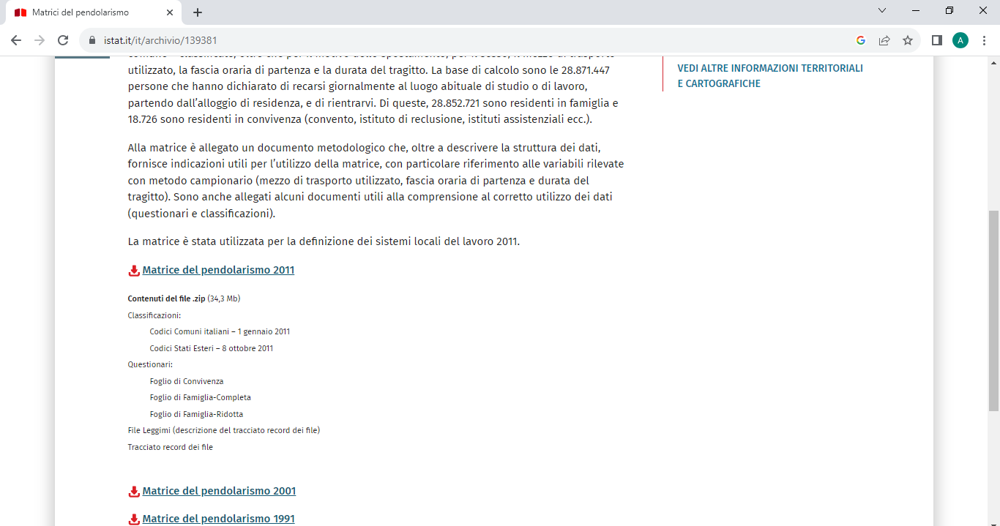
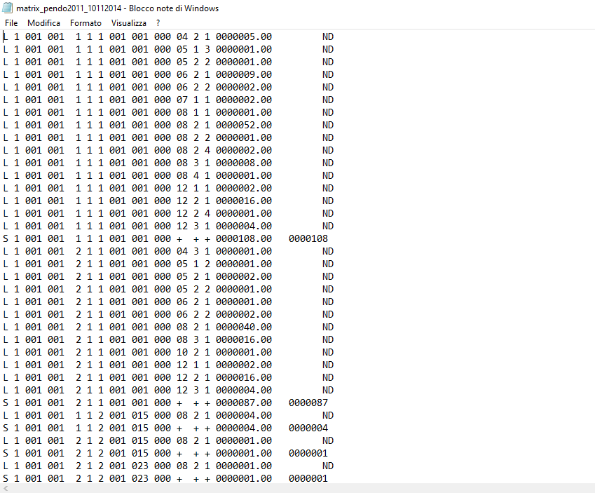
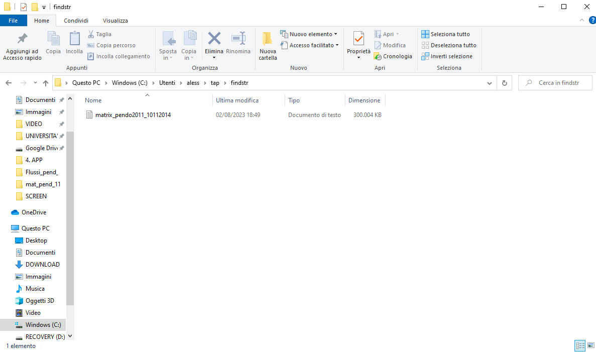
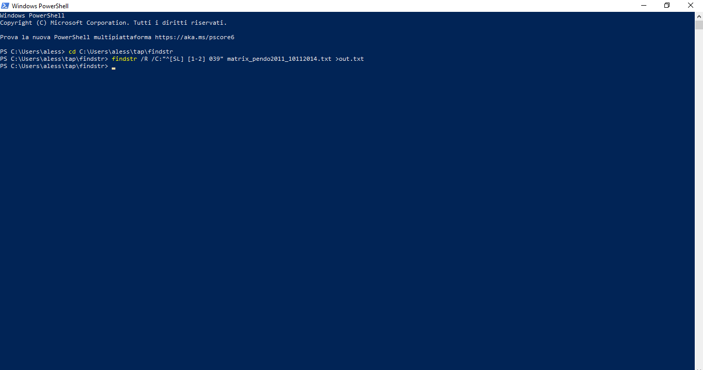

---

## Introduzione

Vista la necessità di operare con la matrice ISTAT del pendolarismo (versione 2011), ho scaricato dall’apposita sezione del sito (https://www.istat.it/it/archivio/139381) la relativa cartella .zip (http://www.istat.it/storage/cartografia/matrici_pendolarismo/matrici_pendolarismo_2011.zip), contenente classificazioni (codici comuni italiani ed esteri), questionari (foglio di convivenza, foglio di famiglia-completa e foglio di famiglia-ridotta), il file.txt contenente la totalità dei record della matrice e il file .doc con la descrizione del tracciato record dei file.

Alla matrice è allegato un documento metodologico che, oltre a descrivere la struttura dei dati, fornisce indicazioni utili per l’utilizzo della matrice, con particolare riferimento alle variabili rilevate con metodo campionario (mezzo di trasporto utilizzato, fascia oraria di partenza e durata del tragitto). Sono anche allegati alcuni documenti utili alla comprensione al corretto utilizzo dei dati (questionari e classificazioni).

Il [file](http://www.istat.it/storage/cartografia/matrici_pendolarismo/matrici_pendolarismo_2011.zip) contiene i dati sul **numero di persone** che si **spostano tra comuni** – o all’interno dello stesso comune – classificate, oltre che per il **motivo dello spostamento**, per il sesso, il mezzo di trasporto utilizzato, la fascia oraria di partenza e la durata del tragitto.



Il file principale, ovvero quello in formato .txt da aprire con il blocco note, si presenta così:



Dovendo operare con i dati di una singola provincia, ho provato ad importarlo in Excel in quanto file con campi fixed, ma la quantità di record presenti nel file (quasi 5 milioni di righe complessivamente) provocava l’eliminazione di circa 4/5 dei dati durante l’importazione.

## Come fare per ridurre il numero di record allo stretto necessario?

Cercando risposte online mi sono imbattuto online nella issue #105 su github.com/opendatasicilia (https://github.com/opendatasicilia/tansignari/issues/105), in cui i gentilissimi @aborruso e @pigreco discutevano di come filtrare tali record PRIMA di effettuare qualsiasi altra operazione, in modo da alleggerire il file e poter lavorare (su Excel o altrove) con un  numero decisamente più contenuto di variabili.
Andrea Borruso ha indicato, a tal proposito, una stringa di ricerca da inserire in Windows PowerShell:

```
findstr /R /C:"^[SL] [1-2] 039" matrix_pendo2011_10112014.txt >out.txt
```

o in ambiente Linux 

```
<matrix_pendo2011_10112014.txt grep -P '^[SL] [1-2] 039' >out.txt
```

si tenga conto che “039” è un codice di provincia esemplificativo, mentre “out” è il nome del file risultante che può essere modificato a piacimento. 


Per i neofiti, come il sottoscritto, di stringhe e linguaggi di programmazione come Windows PowerShell, la procedura per far sì che tale stringa funzioni è la seguente, spiegata anche in un video YouTube proprio da Andrea Borruso (<https://youtu.be/SeG0W0sS9P8>):

 1. Scarica la cartella contenente la matrice 2011 dal sito ISTAT;
 2. Crea una cartella di lavoro temporanea in C:\windows\utenti\nomeutente, nominandola a piacimento (es. “tap”);
 3. Dentro a questa cartella, crea una ulteriore cartella nominandola a piacere (es. “findstr”);
 4. Copia il file.txt contenente i record della matrice ed incollalo dentro quest’ultima cartella;
 5. Accedi su Microsoft PowerShell;
 6. Digita “cd” e copia il percorso della tabella “findstr” creata in precedenza, poi premi INVIO;
 7. Copia la stringa <matrix_pendo2011_10112014.txt grep -P '^[SL] [1-2] 039' >out.txt modificando i campi necessari;
 8. All’interno della cartella “findstr” troverai il file con i record desiderati!





Effettuati questi passaggi, dovresti trovare nella cartella “findstr” un file .txt denominato come hai deciso tu, ma di dimensioni notevolmente ridotte rispetto all’originale. Esso può essere ora importato senza problemi in Excel. 

## Chi ha cucinato questa ricetta o ne ha tratto ispirazione

- [Blog post](https://pigrecoinfinito.com/2020/01/15/pendolarismo-come-creare-un-hub-line-con-qgis/) su Pigrecoinfinito by  _[Totò Fiandaca](https://twitter.com/totofiandaca?lang=it)_

## Riferimenti utili

0. [Link ISTAT](https://www.istat.it/it/archivio/139381)
1. 
